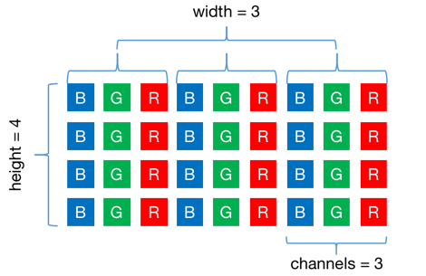
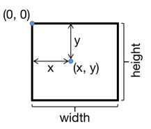
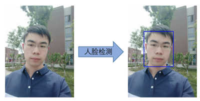
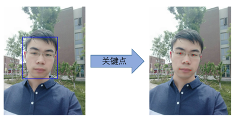
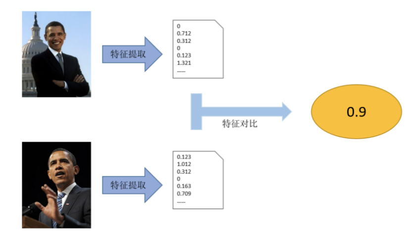
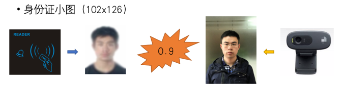
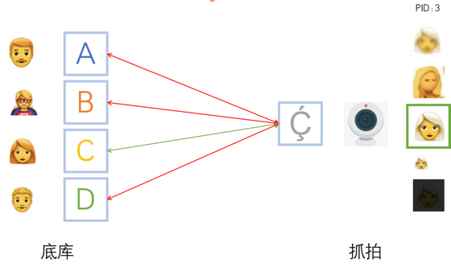
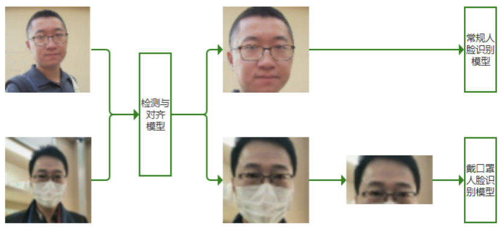

# SeetaFace6 入门教程
-----
## 0. 目录
[TOC]

----
## 1. 前言

该文档通过`leanote`软件编辑，~~可以去博客获取更好的阅读体验~~。

`SeetaFace6` 是中科视拓技术开发体系最新的版本，该版本为开放版，免费供大家使用。该版本包含了人脸识别、活体检测、属性识别、质量评估模块。

本文档基于`SeetaFace`进行讲解，同时也会给出一些通用的算法使用的结论和建议，希望能够给使用`SeetaFace`或者使用其他人脸识别产品的读者提供帮助。

本文档不会提及如何进行代码编译和调试，会对一些关键的可能产生问题的部分进行提醒，开发者可以根据提醒查看是否和本身遇到的问题相符合。

本文档适用于有一定C++基础，能够看懂核心代码片段，并且将代码完成并在对应平台上编译出可执行程序。

其他的预备知识包含`OpenCV`库的基本使用，和一些基本的图像处理的了解。以上都是一个接口的调用，没有使用过也不影响对文档的理解。本书中使用的`OpenCV`库为`2`或`3`版本。

如果您是对C++语言本身存在疑问，而对于库调用已经有经验的话，本文档可能不能直接帮助您。建议先将C++语言作为本文档的前置课程进行学习。同时本文档也会尽可能照顾刚刚接触C++语言的读者。

为了避免过长的代码段影响大家的阅读，因此会把一些必须展示的代码块当道`附录`的`代码块`节。通过这些完整的代码块以便读者可以只根据文档陈列的内容就可以理解`SeetaFace`的基本设定和原理。当然不深入这些繁杂的代码块，也不会完全影响理解和使用。

为了表达的简洁，文档中出现的`代码块`在保留了语义一致性的基础上，还可能经过了删减和调整。实际实现部分的代码，以最终下载的代码为准。

为了照顾不同层次的理解，会对一些基本概念作出解释，一些已经在图像处理或者AI领域的开发者对概念熟悉的读者可以略过相关章节，当理解有偏差时再详细阅读。

因为文档中出现了很多代码，必然要使用英文单词。在文档解释中使用的是中文关键字。限于作者的能力，可能没有办法对文档中出现的所有英文关键字和中文关键字做出一一解释对应。好在代码中使用的英文单词为常用单词，在不影响理解的前提下，其直译的中文含义就是对应上下文中的中文关键字。

写在最后，阅读本文档之前最好先处理好编译的环境，遇到问题直接编译运行。

----
## 2. 基本概念

----
### 2.1 图像

----
#### 2.1.1 结构定义

作为图像处理的C++库，图像存储是一个基本数据结构。
接口中图像对象为`SeetaImageData`。

```cpp
struct SeetaImageData
{
    int width;              // 图像宽度
    int height;             // 图像高度
    int channels;           // 图像通道
    unsigned char *data;    // 图像数据
};
```

这里要说明的是`data`的存储格式，其存储的是连续存放的使用8位无符号整数表示的像素值，存储为`[height, width, channels]`顺序。彩色图像时三通道以`BGR`通道排列。
如下图所示，就是展示了高4宽3的彩色图像内存格式。



该存储在内存中是连续存储。因此，上图中表示的图像`data`的存储空间为`4*3*3=36` `bytes`。

> 提示： `BGR`是`OpenCV`默认的图像格式。在大家很多时候看到就是直接将`cv::Mat`的`data`直接赋值给`SeetaImageData`的`data`。

`data`的数据类型为`uint8`，数值范围为`[0, 255]`，表示了对应的灰度值由最暗到最亮。在一些用浮点数  `float`表示灰度值的平台上，该范围映射到为[0, 1]。

这里详细描述格式是为了对接不同应用场景下的图像库的图像表述格式，这里注意的两点，1. 数据类型是`uint8`表示的`[0, 255]`范围；2. 颜色通道是`BGR`格式，而很多图像库常见的是`RGB`或者`RGBA`(`A`为`alpha`不透明度)。

> 提示：颜色通道会影响识别算法的精度，在不同库的转换时需要小心注意。

这种纯C接口不利于一些资源管理的情况。SeetaFace 提供给了对应`SeetaImageData`的封装`seeta::ImageData`和`seeta::cv::ImageData`。

----
#### 2.1.2 使用示例

以下就是使用`OpenCV`加载图像后转换为`SeetaImageData`的操作。

```cpp
cv::Mat cvimage = cv::imread("1.jpg", cv::IMREAD_COLOR);

SeetaImageData simage;
simage.width = cvimage.cols;
simage.height = cvimage.rows;
simage.channels = cvimage.channels();
simage.data = cvimage.data;
```

> 注意：`simage.data`拿到的是“借来的”临时数据，在试用的期间，必须保证`cvimage`的对象不被释放，或者形式的更新。
> 注意：原始图像可能是空的，为了输入的合法性，需要通过`cvimage.empty()`方法，判断图像是否为空。

这里通过`cv::imread`并且第二个参数设置为`cv::IMREAD_COLOR`，获取到的`cv::Mat`的图像数据是连续存储的，这个是使用`SeetaImageData`必须的。如果不确定是否是连续存储的对象，可以调用下述代码段进行转换。

```cpp
if (!cvimage.isContinuous()) cvimage = cvimage.clone();
```

当然，根据`cv::Mat`和`SeetaImageData`，对象的转换可以逆向。

```cpp
cv::Mat another_cvimage = cv::Mat(simage.height, simage.width, CV_8UC(simage.channels), simage.data);
```

`seeta::ImageData`和`seeta::cv::ImageData`也是基于这种基本的类型定义进行的封装，并加进了对象生命周期的管理。

这里展示了一种封装：

```cpp
namespace seeta
{
    namespace cv
    {
        // using namespace ::cv;
        class ImageData : public SeetaImageData {
        public:
            ImageData( const ::cv::Mat &mat )
                : cv_mat( mat.clone() ) {
                this->width = cv_mat.cols;
                this->height = cv_mat.rows;
                this->channels = cv_mat.channels();
                this->data = cv_mat.data;
            }
        private:
            ::cv::Mat cv_mat;
        };
    }
}
```

这样`SeetaImageData`使用代码就可以简化为：

```cpp
seeta::cv::ImageData = cv::imread("1.jpg");
```

因为`seeta::cv::ImageData`继承了`SeetaImageData`，因此在需要传入`const SeetaImageData &`类型的地方，可以直接传入`seeta::cv::ImageData`对象。

> 注意：在没有特殊说明的情况下，`SeetaFace`各个模块的输入图像都必须是`BGR`通道格式的彩色图像。

> 参考：`CStruct.h`、`Struct.h` 和 `Struct_cv.h`。

----
### 1.2 坐标系

----
#### 1.2.1 结构定义

我们在表示完图像之后，我们还需要在图像上表示一些几何图形，例如矩形和点，这两者分别用来表示人脸的位置和人脸关键点的坐标。

这我们采用的屏幕坐标系，也就是以左上角为坐标原点，屏幕水平向右方向为横轴，屏幕垂直向下方向为纵轴。坐标以像素为单位。



坐标值会出现负值，并且可以为实数，分别表示超出屏幕的部分，和位于像素中间的坐标点。

有了以上的基本说明，我们就可以给出矩形、坐标点或其他的定义。

```cpp
/**
 * 矩形
 */
struct SeetaRect
{
    int x;      // 左上角点横坐标
    int y;      // 左上角点纵坐标
    int width;  // 矩形宽度
    int height; // 矩形高度
};
/**
 *宽高大小
 */
struct SeetaSize
{
    int width;  // 宽度
    int height; // 高度
};
/**
 * 点坐标
 */
struct SeetaPointF
{
    double x;   // 横坐标
    double y;   // 纵坐标
};
```

> 注意：从表达习惯上，坐标和形状大小的表示，通常是横坐标和宽度在前，这个和图片表示的时候内存坐标是高度在前的表示有差异，在做坐标变换到内存偏移量的时候需要注意。

----
#### 1.2.2 使用示例

这种基本数据类型的定义，在拿到以后就确定的使用方式，这里距离说明，如果拿到这种图片，如何绘制到图片上。

首先我们假定图像、矩形和点的定义。

```cpp
cv::Mat canvas = cv::imread("1.jpg");
SeetaRect rect = {20, 30, 40, 50};
SeetaPointF point = {40, 55};
```

当变量已经具有了合法含义的时候，就可以进行对应绘制。

```cpp
// 绘制矩形
cv::rectangle(canvas, cv::Rect(rect.x, rect.y, rect.width, rect.height), CV_RGB(128, 128, 255), 3);
// 绘制点
cv::circle(canvas, cv::Point(point.x, point.y), 2, CV_RGB(128, 255, 128), -1);
```

> 参考：`CStruct.h`和`Struct.h`。

### 1.3 模型设置

在算法开发包中，除了代码库本身以外，还有数据文件，我们通常称之为模型。

这里给出`SeetaFace`的模型设置的基本定义：

```cpp
enum SeetaDevice
{
    SEETA_DEVICE_AUTO = 0,
    SEETA_DEVICE_CPU  = 1,
    SEETA_DEVICE_GPU  = 2,
};

struct SeetaModelSetting
{
    enum SeetaDevice device;
    int id; // when device is GPU, id means GPU id
    const char **model; // model string terminate with nullptr
};
```

这里要说明的是`model`成员，是一种C风格的数组，以`NULL`为结束符。一种典型的初始化为，设定模型为一个`fr_model.csta`，运行在`cpu:0`上。

```cpp
SeetaModelSetting setting;
setting.device = SEETA_DEVICE_CPU;
setting.id = 0;
setting.model = {"fr_model.csta", NULL};
```

当然`SeetaFace`也对应封装了`C++`版本设置方式，继承关系为，详细的实现见`附录`中的`代码块`：
```cpp
class seeta::ModelSetting : SeetaModelSetting;
```

实现代码见`Struct.h`，使用方式就变成了如下代码段，默认在`cpu:0`上运行。

```cpp
seeta::ModelSetting setting;
setting.append("fr_model.csta");
```

有了通用模型的设置方式，一般实现时的表述就会是`加载一个人脸识别模型`，模型加载的方式都是构造`SeetaModelSetting`，传入对应的算法对象。

> 参考：`CStruct.h`和`Struct.h`。

### 1.4 对象生命周期

对象生命周期是C++中一个非常重要的概念，也是`RAII`方法的基本依据。这里不会过多的解释C++语言本身的特性，当然文档的篇幅也不允许做一个完整阐述。

以人脸识别器`seeta::Recognizer`为例，假设模型设置如`1.3`节展示，那么构造识别器就有两种方式：

```cpp
seeta::FaceRecognizer FR(setting);
```
或者
```cpp
seeta::FaceRecognizer *pFD = new seeta::FaceRecognizer(setting);
```
当然后者在`pFD`不需要使用之后需要调用`delete`进行资源的释放
```cpp
delete pFD;
```
前者方式构造`FD`对象，当离开FD所在的代码块后（一般是最近的右花括号）后就会释放。

上述基本的概念相信读者能够很简单的理解。下面说明几点`SeetaFace`与对象声明周期相关的特性。

`1.` 识别器对象不可以被复制或赋值。
```cpp
seeta::FaceRecognizer FR1(setting);
seeta::FaceRecognizer FR2(setting);
seeta::FaceRecognizer FR3 = FR1;    // 错误
FF2 = FR1;      // 错误
```
因此在函数调用的时候，以值传递识别器对象是不被允许的。如果需要对象传递，需要使用对象指针。
这个特性是因为为了不暴露底层细节，保证接口的ABI兼容性，采用了`impl`指针隔离实现的方式。

`2.` `借用`指针对象不需要释放。
例如，人脸检测器的检测接口，接口声明为：
```cpp
struct SeetaFaceInfo
{
    SeetaRect pos;
    float score;
};
struct SeetaFaceInfoArray
{
    struct SeetaFaceInfo *data;
    int size;
};
SeetaFaceInfoArray FaceDetector::detect(const SeetaImageData &image) const;
```
其中`SeetaFaceInfoArray`的`data`成员就是`借用`对象，不需要外部释放。
没有强调声明的接口，就不需要对指针进行释放。当然，纯C接口中返回的对象指针是`新对象`，所以需要对应的对象释放函数。

`3.` 对象的构造和释放会比较耗时，建议使用对象池在需要频繁使用新对象的场景进行对象复用。

### 1.5 线程安全性

线程安全也是开发中需要重点关注的特性。然而，线程安全在不同的上下文解释中总会有不同解释。为了避免理解的偏差，这里用几种不同的用例去解释识别器的使用。

`1.` 对象可以跨线程传递。线程1构造的识别器，可以在线程2中调用。  
`2.` 对象的构造可以并发`构造`，即可以多个线程同时构造识别器。  
`3.` 单个对象的接口调用不可以并发调用，即单个对象，在多个线程同时使用是被禁止的。  

当然一些特殊的对象会具有更高级别的线程安全级别，例如`seeta::FaceDatabase`的接口调用就可以并发调用，但是计算不会并行。

## 2. 人脸检测和关键点定位

终于经过繁杂的基础特性说明之后，迎来了两个重要的识别器模块。人脸检测和关键点定位。

`人脸检测`, `seeta::FaceDetector` 就是输入待检测的图片，输出检测到的每个人脸位置，用矩形表示。  
`关键点定位`，`seeta::FaceLandmarker`就是输入待检测的图片，和待检测的人脸位置，输出`N`个关键点的坐标（图片内）。

两个模块分别负责找出可以处理的人脸位置，检测出关键点用于标定人脸的状态，方便后续的人脸对齐后进行对应识别分析。

### 2.1 人脸检测器

人脸检测器的效果如图所示：  


这里给出人脸检测器的主要接口：
```cpp
namespace seeta {
    class FaceDetector {
        FaceDetector(const SeetaModelSetting &setting);
        SeetaFaceInfoArray detect(const SeetaImageData &image) const;
        std::vector<SeetaFaceInfo> detect_v2(const SeetaImageData &image) const;
        void set(Property property, double value);
        double get(Property property) const;
    }
}
```
构造一个检测器的函数参考如下：
```cpp
#include <seeta/FaceDetector.h>
seeta::FaceDetector *new_fd() {
    seeta::ModelSetting setting;
    setting.append("face_detector.csta");
    return new seeta::FaceDetector(setting);
}
```
有了检测器，我们就可以对图片检测人脸，检测图片中所有人脸并打印坐标的函数参考如下：
```cpp
#include <seeta/FaceDetector.h>
void detect(seeta::FaceDetector *fd, const SeetaImageData &image) {
    std::vector<SeetaFaceInfo> faces = fd->detect_v2(image);
    for (auto &face : faces) {
        SeetaRect rect = face.pos;
        std::cout << "[" << rect.x << ", " << rect.y << ", "
                  << rect.width << ", " << rect.height << "]: "
                  << face.score << std::endl;
    }
}
```
这里要说明的是，一般检测返回的所有人脸是按照置信度排序的，当应用需要获取最大的人脸时，可以对检测结果进行一个`部分排序`获取出最大的人脸，如下代码排序完成后，`faces[0]`就是最大人脸的位置。
```cpp
std::partial_sort(faces.begin(), faces.begin() + 1, faces.end(), [](SeetaFaceInfo a, SeetaFaceInfo b) {
    return a.pos.width > b.pos.width;
});
```
人脸检测器可以设置一些参数，通过`set`方法。可以设置的属性有:
```
seeta::FaceDetector::PROPERTY_MIN_FACE_SIZE     最小人脸
seeta::FaceDetector::PROPERTY_THRESHOLD         检测器阈值
seeta::FaceDetector::PROPERTY_MAX_IMAGE_WIDTH   可检测的图像最大宽度
seeta::FaceDetector::PROPERTY_MAX_IMAGE_HEIGHT  可检测的图像最大高度
```
`最小人脸`是人脸检测器常用的一个概念，默认值为`20`，单位像素。它表示了在一个输入图片上可以检测到的最小人脸尺度，注意这个尺度并非严格的像素值，例如设置最小人脸80，检测到了宽度为75的人脸是正常的，这个值是给出检测能力的下限。

`最小人脸`和检测器性能息息相关。主要方面是速度，使用建议上，我们建议在应用范围内，这个值设定的越大越好。`SeetaFace`采用的是`BindingBox Regresion`的方式训练的检测器。如果`最小人脸`参数设置为80的话，从检测能力上，可以将原图缩小的原来的1/4，这样从计算复杂度上，能够比最小人脸设置为20时，提速到16倍。

`检测器阈值`默认值是0.9，合理范围为`[0, 1]`。这个值一般不进行调整，除了用来处理一些极端情况。这个值设置的越小，漏检的概率越小，同时误检的概率会提高；

`可检测的图像最大宽度`和`可检测的图像最大高度`是相关的设置，默认值都是`2000`。最大高度和宽度，是算法实际检测的高度。检测器是支持动态输入的，但是输入图像越大，计算所使用的内存越大、计算时间越长。如果不加以限制，一个超高分辨率的图片会轻易的把内存撑爆。这里的限制就是，当输入图片的宽或者高超过限度之后，会自动将图片缩小到限制的分辨率之内。

我们当然希望，一个算法在各种场景下都能够很好的运行，但是自然规律远远不是一个几兆的文件就是能够完全解释的。应用上总会需要取舍，也就是`trade-off`。

### 2.2 人脸关键点定位器

关键点定位器的效果如图所示：  


关键定定位输入的是原始图片和人脸检测结果，给出指定人脸上的关键点的依次坐标。

这里检测到的5点坐标循序依次为，左眼中心、右眼中心、鼻尖、左嘴角和右嘴角。
注意这里的左右是基于图片内容的左右，并不是图片中人的左右，即左眼中心就是图片中左边的眼睛的中心。

同样的方式，我们也可以构造关键点定位器：
```cpp
#include <seeta/FaceLandmarker.h>
seeta::FaceLandmarker *new_fl() {
    seeta::ModelSetting setting;
    setting.append("face_landmarker_pts5.csta");
    return new seeta::FaceLandmarker(setting);
}
```

根据人脸检测关键点，并将坐标打印出来的代码如下：
```cpp
#include <seeta/FaceLandmarker.h>
void mark(seeta::FaceLandmarker *fl, const SeetaImageData &image, const SeetaRect &face) {
    std::vector<SeetaPointF> points = fl->mark(image, face);
    for (auto &point : points) {
        std::cout << "[" << point.x << ", " << point.y << "]" << std::endl;
    }
}
```

当然开放版也会有多点的模型放出来，限于篇幅不再对点的位置做过多的文字描述。
例如`face_landmarker_pts68.csta`就是68个关键点检测的模型。其坐标位置可以通过逐个打印出来进行区分。

这里需要强调说明一下，这里的关键点是指人脸上的关键位置的坐标，在一些表述中也将`关键点`称之为`特征点`，但是这个和人脸识别中提取的特征概念没有任何相关性。并不存在结论，关键点定位越多，人脸识别精度越高。

一般的关键点定位和其他的基于人脸的分析是基于5点定位的。而且算法流程确定下来之后，只能使用5点定位。5点定位是后续算法的先验，并不能直接替换。从经验上来说，5点定位已经足够处理人脸识别或其他相关分析的精度需求，单纯增加关键点个数，只是增加方法的复杂度，并不对最终结果产生直接影响。

> 参考：`seeta/FaceDetector.h` `seeta/FaceLandmarker.h`

## 3. 人脸特征提取和对比

这两个重要的功能都是`seeta::FaceRecognizer`模块提供的基本功能。特征提取方式和对比是对应的。

这是人脸识别的一个基本概念，就是将待识别的人脸经过处理变成二进制数据的特征，然后基于特征表示的人脸进行相似度计算，最终与`相似度阈值`对比，一般超过阈值就认为特征表示的人脸是同一个人。



这里`SeetaFace`的特征都是`float`数组，特征对比方式是向量內积。

### 3.1 人脸特征提取

首先可以构造人脸识别器以备用：
```cpp
#include <seeta/FaceRecognizer.h>
seeta::FaceRecognizer *new_fr() {
    seeta::ModelSetting setting;
    setting.append("face_recognizer.csta");
    return new seeta::FaceRecognizer(setting);
}
```

特征提取过程可以分为两个步骤：1. 根据人脸5个关键点裁剪出`人脸区域`；2. 将`人脸区域`输入特征提取网络提取特征。
这两个步骤可以分开调用，也可以独立调用。

两个步骤分别对应`seeta::FaceRecognizer`的`CropFaceV2`和`ExtractCroppedFace`。也可以用`Extract`方法一次完成两个步骤的工作。

这里列举使用`Extract`进行特征提取的函数：
```cpp
#include <seeta/FaceRecognizer.h>
#include <memory>
std::shared_ptr<float> extract(
        seeta::FaceRecognizer *fr,
        const SeetaImageData &image,
        const std::vector<SeetaPointF> &points) {
    std::shared_ptr<float> features(
        new float[fr->GetExtractFeatureSize()],
        std::default_delete<float[]>());
    fr->Extract(image, points.data(), features.get());
    return features;
}
```
同样可以给出相似度计算的函数：
```cpp
#include <seeta/FaceRecognizer.h>
#include <memory>
float compare(seeta::FaceRecognizer *fr,
        const std::shared_ptr<float> &feat1,
        const std::shared_ptr<float> &feat2) {
    return fr->CalculateSimilarity(feat1.get(), feat2.get());
}
```

> 注意：这里`points`的关键点个数必须是`SeetaFace`提取的5点关键点。

特征长度是不同模型可能不同的，要使用`GetExtractFeatureSize`方法获取当前使用模型提取的特征长度。

相似度的范围是`[0, 1]`，但是需要注意的是，如果是直接用內积计算的话，因为特征中存在复数，所以计算出的相似度可能为负数。识别器内部会将负数映射到0。

在一些特殊的情况下，需要将特征提取分开两步进行，比如前端裁剪处理图片，服务器进行特征提取和对比。下面给出分步骤的特征提取方式：
```cpp
#include <seeta/FaceRecognizer.h>
#include <memory>
std::shared_ptr<float> extract_v2(
        seeta::FaceRecognizer *fr,
        const SeetaImageData &image,
        const std::vector<SeetaPointF> &points) {
    std::shared_ptr<float> features(
        new float[fr->GetExtractFeatureSize()],
        std::default_delete<float[]>());
    seeta::ImageData face = fr->CropFaceV2(image, points.data());
    fr->ExtractCroppedFace(face, features.get());
    return features;
}
```

函数中间临时申请的`face`和`features`的对象大小，在识别器加载后就已经固定了，所以这部分的内存对象是可以复用的。

特别指出，如果只是对一个图像中最大人脸做特征提取的函数可以实现为：
```
std::shared_ptr<float> extract(
        seeta::FaceDetector *fd,
        seeta::FaceLandmarker *fl,
        seeta::FaceRecognizer *fr,
        const SeetaImageData &image) {
    auto faces = fd->detect_v2(image);
    if (faces.empty()) return nullptr;
    std::partial_sort(faces.begin(), faces.begin() + 1, faces.end(),
        [](SeetaFaceInfo a, SeetaFaceInfo b) {
            return a.pos.width > b.pos.width;
    });
    auto points = fl->mark(image, faces[0].pos);
    return extract(fr, image, points);
}
```

### 3.2 人脸特征对比

在上一节我们已经介绍了特征提取和对比的方法，这里我们直接展开讲述特征相似度计算的方法。

下面我们直接给出特征对比的方法，C语言版本的实现：
```cpp
float compare(const float *lhs, const float *rhs, int size) {
    float sum = 0;
    for (int i = 0; i < size; ++i) {
        sum += *lhs * *rhs;
        ++lhs;
        ++rhs;
    }
    return sum;
}

```

基于內积的特征对比方法，就可以采用`gemm`或者`gemv`的通用数学方法优化特征的对比的性能了。

### 3.3 各种识别模型特点

`SeetaFace6`第一步共开放了三个识别模型，其对比说明如下：

文件名 |  特征长度 | 一般阈值 | 说明
-|-|-
face_recognizer.csta | 1024 | 0.62 | 通用场景高精度人脸识别
face_recognizer_mask.csta | 512 | 0.48 | 带口罩人脸识别模型
face_recognizer_light.csta | 512 |0.55| 轻量级人脸识别模型

这里的一般阈值是一般场景使用的推荐阈值。一般来说1比1的场景下，该阈值会对应偏低，1比N场景会对应偏高。

需要注意的是，不同模型提取的特征是不具备可比较性的，哪怕特征一样。如果在正在运行的系统替换了识别模型的话，所有底库照片全部需要重新提取特征再进行比较才行。

### 3.4 关于相似度和阈值

在`3.3`节我们给出了不同模型的`一般阈值`。阈值起到的作用就是给出识别结果是否是同一个人的评判标准。如果两个特征的相似度超过阈值，则认为两个特征所代表的人脸就是同一个人。

因此该阈值和对应判断的相似度，是算法统计是否一个人的评判标准，并不等同于自然语义下的人脸的相似度。这样表述可能比较抽象，说个具体的例子就是，相似度0.5，在阈值是0.49的时候，就表示识别结果就是一个人，这个相似度也不表示两个人脸有一半长的一样。同理相似度100%，也不表示两个人脸完全一样，连岁月的痕迹也没有留下。

但是`0.5`就表示是同一个人，从通常认知习惯中往往`80%`相似才是一个人。这个时候我们一般的做法是做相似度映射，将只要通过系统识别是同一个人的时候，就将其相似度映射到0.8以上。

综上所述，识别算法直接给出来的相似度如果脱离阈值就没有意义。识别算法的性能好不好，主要看其给出的不同样本之间的相似度有没有区分性，能够用阈值将正例和负例样本区分开来。

而比较两个识别算法精度的时候，一般通常的算法就是画出`ROC`，也就是得出不同阈值下的性能做统一比较。这种情况下，及时使用了相似度变换手段，只要是正相关的映射，那么得到的`ROC`曲线也会完全一致。

这里对一种错误的测试方式给出说明。经常有人提出问题，A算法比B算法效果差，原因是拿两张照片，是同一个人，A算法给出的相似度比B算法给出的低。诚然，“效果”涉及到的因素很多，比如识别为同一个人就应该给出极高的相似度。但是经过上述讨论，希望读者能够自然的明白这种精度测试方式的片面性。

### 3.5 1比1和1比N

一般的人脸识别应用，我们都可以这样去区分，1比1和1比N。当然也有说法是1比1就是当N=1时的1比N。这里不详细展开说明这两者的区别。实际应用还是要因地制宜，并没有统一的模板套用。这里我们给出一般说法的两种应用。



一般的1比1识别，狭义上讲就是人证对比，使用读卡器从身份证，或者其他介质上读取到一张照片，然后和现场抓拍到的照片做对比。这种一般是做认证的场景，用来判别证件、或者其他凭证方式是否是本人在进行操作。因此广义上来讲，员工刷工卡，然后刷脸认证；个人账户进行刷脸代替密码；这种知道待识别人员身份，然后进行现场认证的方式，都可以属于1比1识别的范畴。



1比N识别与1比1区别在于，对于现场待识别的人脸，不知道其身份，需要在一个底库中去查询，如果在底库中给出对应识别结果，如果不在底库中，报告未识别。如果业务场景中，确定待识别的人脸一定在底库中，那么就是一个闭集测试，也可以称之为人脸检索。反之，就是开集测试。

由描述可以看出，开集场景要比闭集场景更困难，因为要着重考虑误识别率。

1比N识别从接口调用上来说，首先需要将底库中的人脸全部提取特征，然后，对现场抓拍到的待识别人脸提取特征，最终使用特征与底库中的特征进行比较选出相似度最高的人脸，这时相似度若超过阈值，则认为识别成功，反之待识别人员不在底库。

而常见的1比N识别就是摄像头下的动态人脸识别。这个时候就必要提出我们后面要讲解的模块`人脸跟踪`和`质量评估`。

这两者在动态人脸识别中用来解决运行效率和精度的问题。首先动态人脸识别系统中，往往待识别人员会再摄像头下运动，并保持一段时间。这个时候需要跟踪从一开始确定，摄像头下现在出现的是一个人。在这个基础上，同一个人只需要识别一次即可。而这个用来识别的代表图片，就是要利用质量评估模块，选出对识别效果最好的一张用来识别。

`人脸跟踪`和`质量评估`两个方法的配合使用，即避免了每一帧都识别对系统的压力，也通过从多帧图像中选择质量过关且最好的图片来识别，提高了识别精度。

### 3.6 人脸识别优化

在3.5节中文档介绍了1比N的基本运行方式和手段，

由3.4节关于相似度和阈值的讨论，可以得出基本推论：如果阈值设置越高，那么误识别率越低，相对识别率也会变低；阈值设置越低，识别率会变高，同时误识别率也会变高。

这种特性也会导致我们在使用的过程中，会陷入如何调整阈值都得到好的效果的尴尬境地。这个时候我们就不止说要调节表面的阈值，其实这个时候就必要引入人脸识别应用的时候重要的部分：底库。

底库人脸图片的质量往往决定了系统整体的识别性能，一般对于底库要求有两个维度：1. 要求的底库（人脸）图片质量越高越好，从内容上基本都是正面、自然光照、自然表情、无遮挡等等，从图像上人脸部分 128x128 像素一样，无噪声，无失真等等；2. 底库图片的成像越接近部署环境越好。而这两个维度并往往可以统一考虑。

底库图片要求的两个维度，一般翻译到应用上：前者就是需要尽可能的人员近期照片，且图像质量好，图片传输要尽可能保真，这个一般做应用都会注意到；后者一般的操作我们称之为现场注册，使用相同的摄像头，在待识别的场景下进行注册。而后者，往往会包含对前者的要求，所以实际应用的效果会更好。

另外，综合来说还应当避免：1. 对人脸图片做失真编辑，如PS、美图等。2. 浓妆。从成像的基本原理来说，识别算法必然会受到化妆的影响。基于之前底库人脸照片的两个原则，不完全强调使用素颜照片，但是要底库照片和现场照片要保证最基本的可辨识程度。

人都做不到的事情，就不要难为计算机了。

上述对底库的要求，同样适用于对现场照片的要求。因为从特征对比的角度，两个特征的来源是对称的。

我们在后面的章节中会提到质量评估模块，提供了一般性通用的质量评估方式。通过该模块，就可以对不符合识别要求的图片进行过滤，提高整体的识别性能。

> 备注：`SeetaFace6`会给出较为完整的动态人脸识别的开发实例，参见开放版的发布平台。
> 备注：人脸识别还有一个抽象程度更高的接口`seeta::FaceDatabase`。具体使用参照`SeetaFace2`开源版本。
> 参考：`seeta/FaceRecognizer.h`、`seeta/FaceDatabase.h`

## 4. 活体检测

在介绍人脸识别很关键的人脸跟踪和质量评估之前，先看一个对应用很重要的`活体检测`模块。

关于活体检测模块的重要程度和原因，这里不做过多赘述，这里直接给出`SeetaFace`的活体检测方案。

活体检测结合了两个方法，`全局活体检测`和`局部活体检测`。

`全局活体检测`就是对图片整体做检测，主要是判断是否出现了活体检测潜在的攻击介质，如手机、平板、照片等等。

`局部活体检测`是对具体人脸的成像细节通过算法分析，区别是一次成像和二次成像，如果是二次成像则认为是出现了攻击。

### 4.1 基本使用

区别于之前的模块，活体检测识别器可以加载一个`局部检测`模型或者`局部检测`模型+`全局检测`模型。

这里只加载一个`局部检测`模型：
```cpp
#include <seeta/FaceAntiSpoofing.h>
seeta::FaceAntiSpoofing *new_fas() {
    seeta::ModelSetting setting;
    setting.append("fas_first.csta");
    return new seeta::FaceAntiSpoofing(setting);
}
```
或者`局部检测`模型+`全局检测`模型，启用全局检测能力：
```cpp
#include <seeta/FaceAntiSpoofing.h>
seeta::FaceAntiSpoofing *new_fas_v2() {
    seeta::ModelSetting setting;
    setting.append("fas_first.csta");
    setting.append("fas_second.csta");
    return new seeta::FaceAntiSpoofing(setting);
}
```

调用有两种模式，一个是单帧识别，另外就是视频识别。
其接口声明分别为：
```cpp
seeta::FaceAntiSpoofing::Status seeta::FaceAntiSpoofing::Predict( const SeetaImageData &image, const SeetaRect &face, const SeetaPointF *points ) const;
seeta::FaceAntiSpoofing::Status seeta::FaceAntiSpoofing::PredictVideo( const SeetaImageData &image, const SeetaRect &face, const SeetaPointF *points ) const;
```

从接口上两者的入参和出参的形式是一样的。出参这里列一下它的声明：
```cpp
class FaceAntiSpoofing {
public:
    /*
     * 活体识别状态
     */
    enum Status
    {
        REAL = 0,       ///< 真实人脸
        SPOOF = 1,      ///< 攻击人脸（假人脸）
        FUZZY = 2,      ///< 无法判断（人脸成像质量不好）
        DETECTING = 3,  ///< 正在检测
    };
}
```

`单帧识别`返回值会是`REAL`、`SPOOF`或`FUZZY`。
`视频识别`返回值会是`REAL`、`SPOOF`、`FUZZY`或`DETECTING`。

两种工作模式的区别在于前者属于一帧就是可以返回识别结果，而后者要输入多个视频帧然后返回识别结果。在`视频识别`输入帧数不满足需求的时候，返回状态就是`DETECTING`。

这里给出单帧识别调用的示例：
```cpp
void predict(seeta::FaceAntiSpoofing *fas, const SeetaImageData &image, const SeetaRect &face, const SeetaPointF *points) {
    auto status = fas->Predict(image, face, points);
    switch(status) {
    case seeta::FaceAntiSpoofing::REAL:
        std::cout << "真实人脸" << std::endl; break;
    case seeta::FaceAntiSpoofing::SPOOF:
        std::cout << "攻击人脸" << std::endl; break;
    case seeta::FaceAntiSpoofing::FUZZY:
        std::cout << "无法判断" << std::endl; break;
    case seeta::FaceAntiSpoofing::DETECTING:
        std::cout << "正在检测" << std::endl; break;
    }
}
```
这里需要注意`face`和`points`必须对应，也就是`points`必须是`face`表示的人脸进行关键点定位的结果。`points`是5个关键点。当然`image`也是需要识别的原图。

如果是`视频识别`模式的话，只需要将`predict`中的`fas->Predict(image, face, points)`修改为`fas->PredictVideo(image, face, points)`。

在`视频识别`模式中，如果该识别结果已经完成，需要开始新的视频的话，需要调用`ResetVideo`重置识别状态，然后重新输入视频：
```cpp
void reset_video(seeta::FaceAntiSpoofing *fas) {
    fas->ResetVideo();
}
```

当了解基本调用接口之后，就可以直接看出来，识别接口直接输入的就是单个人脸位置和关键点。因此，当视频或者图片中存在多张人脸的时候，需要业务决定具体识别哪一个人脸。一般有这几种选择，1. 只做单人识别，当出现两个人的时候识别中止。2. 识别最大的人脸。3. 识别在指定区域中出现的人脸。这几种选择对精度本身影响不大，主要是业务选型和使用体验的区别。

### 4.2 参数设置

设置视频帧数：
```cpp
void SetVideoFrameCount( int32_t number );
```
默认为10，当在`PredictVideo`模式下，输出帧数超过这个`number`之后，就可以输出识别结果。这个数量相当于多帧识别结果融合的融合的帧数。当输入的帧数超过设定帧数的时候，会采用滑动窗口的方式，返回融合的最近输入的帧融合的识别结果。一般来说，在10以内，帧数越多，结果越稳定，相对性能越好，但是得到结果的延时越高。

设置识别阈值：
```cpp
void SetThreshold( float clarity, float reality );
```
默认为`(0.3, 0.8)`。活体识别时，如果清晰度(clarity)低的话，就会直接返回`FUZZY`。清晰度满足阈值，则判断真实度（`reality`），超过阈值则认为是真人，低于阈值是攻击。在视频识别模式下，会计算视频帧数内的平均值再跟帧数比较。两个阈值都符合，越高的话，越是严格。


设置全局检测阈值：
```
void SetBoxThresh(float box_thresh);
```
默认为0.8，这个是攻击介质存在的分数阈值，该阈值越高，表示对攻击介质的要求越严格，一般的疑似就不会认为是攻击介质。这个一般不进行调整。

以上参数设置都存在对应的`Getter`方法，将方法名称中的`Set`改为`Get`就可以访问对应的参数获取了。

### 4.3 参数调试

在应用过程中往往不可避免对阈值产生疑问，如果要调试对应的识别的阈值，这里我们给出了每一帧分数的获取函数。

下面给出识别之后获取识别具体分数的方法：

```cpp
void predict_log(seeta::FaceAntiSpoofing *fas, const SeetaImageData &image, const SeetaRect &face, const SeetaPointF *points) {
    auto status = fas->Predict(image, face, points);
    float clarity, reality;
    fas->GetPreFrameScore(&clarity, &reality);
    std::cout << "clarity = " << clarity << ", reality = " << reality << std::endl;
}
```

在`Predict`或者`PredictVideo`之后，调用`GetPreFrameScore`方法可以获取刚刚输入帧的识别分数。

> 参考：`seeta/FaceAntiSpoofing.h`

### 4.3 其他建议

活体识别内容增加了对图像清晰度的判断，但是还是有对其他方面的质量要求，比如人脸分辨率128x128以上，光照均匀，自然表情等。其中主要影响识别精度的为光照环境，这些都可以通过后面的`质量评估`模块做到。

另外局部活体检测利用了人脸周围的上下文信息，因此要求人脸不能够靠近边缘，处于图像边缘会导致上下文信息缺失影响精度。这种场景下一般会在屏幕交互时画出`ROI`区域，在`ROI`区域内在合适的距离和人脸分辨率下进行识别。

## 5. 人脸跟踪

人脸跟踪也是基于人脸的基本模块，其要解决的问题是在进行识别之前就利用视频特性，首先就确认在视频序列中出现的那些人是同一人。

这里先给出人脸跟踪结果的结构体：
```cpp
struct SeetaTrackingFaceInfo
{
    SeetaRect pos;
    float score;

    int frame_no;
    int PID;
    int step;
};

struct SeetaTrackingFaceInfoArray
{
    struct SeetaTrackingFaceInfo *data;
    int size;
};
```

对比与`SetaFaceInfo`增加了`PID`字段。`frame_no`和`step`为内部调试保留字段，一般不使用。`pos`字段是`SeetaRect`类型，可以替代直接人脸检测器的检测结果的`pos`使用。

`PID`就是人员编号，对于视频中出现的人脸，如果跟踪分配了同一个`PID`，那么就可以认为相同`PID`的人脸属于同一个人。

同样，适用之前先要构造人脸跟踪器：
```cpp
#include <seeta/FaceTracker.h>
seeta::FaceTracker *new_ft() {
    seeta::ModelSetting setting;
    setting.append("face_detector.csta");
    return new seeta::FaceTracker(setting, 1920, 1080);
}
```
这里代码构造了用于跟踪`1920x1080`分辨率视频的人脸跟踪器，这里人脸跟踪器要传入的模型就是人脸检测的模型。

下面就是打印出跟踪到的人脸的PID以及坐标位置的函数：
```cpp
#include <seeta/FaceTracker.h>
void track(seeta::FaceTracker *ft, const SeetaImageData &image) {
    SeetaTrackingFaceInfoArray cfaces = ft->Track(image);
    std::vector<SeetaTrackingFaceInfo> faces(cfaces.data, cfaces.data + cfaces.size);
    for (auto &face : faces) {
        SeetaRect rect = face.pos;
        std::cout << "[" << rect.x << ", " << rect.y << ", "
                  << rect.width << ", " << rect.height << "]: "
                  << face.score << ", PID=" << face.PID << std::endl;
    }
}
```

当检测逻辑断开，或者切换视频的时候，就需要排除之前跟踪的逻辑，这个时候调用`Reset`方式清楚之前所有跟踪的结果，重新`PID`计数：
```cpp
void reset(seeta::FaceTracker *ft) {
    ft->Reset();
}
```

人脸跟踪器和人脸检测器一样，可以设置检测器的基本参数：
```cpp
ft->SetMinFaceSize(80);     // 设置最小人脸80
ft->SetThreshold(0.9f);     // 设置检测器的分数阈值
```

当然还有人脸跟踪器专有的参数设置。

设置视频稳定性：
```cpp
void seeta::FaceTracker::SetVideoStable(bool stable = true);
```
当这个参数设为真的话，就会进行检测结果的帧间平滑，使得检测结果从视觉上更好一些。

设置检测间隔：
```cpp
void seeta::FaceTracker::SetInterval(int interval); 
```
间隔默认值为10。这里跟踪间隔是为了发现新增`PID`的间隔。检测器会通过整张图像检测人脸去发现是否有新增的`PID`，所以这个值太小会导致跟踪速度变慢（不断做全局检测）；这个值太大会导致画面中新增加的人脸不会立马被跟踪到。

`SetInterval`的默认值是根据FPS为25设定的。在应用中往往会产生跳帧，如果跳帧为1的话，相当于FPS变成了12.5。这个时候就可以将跟踪间隔设置为5。

人脸跟踪不等同与人群计数算法。从目标上来说是为了保证同一个PID为同一个人为第一要务，这样可以减小识别分析的压力。另外，人脸跟踪是基于出现的人脸，如果没有漏出人脸也做计数的话，结果差距会很大。当然，统计PID个数来统计摄像头前出现人脸的`人次`还是可以的。

> 参考：`seeta/FaceTracker.h`

## 6. 质量评估

`SeetaFace6`开放的质量评估模块包含了多个子模块，包括`亮度评估`、`清晰度评估`、`完整度评估`、`清晰度评估（深度）`、`姿态评估`、`姿态评估（深度）`、`分辨率评估`。

首先说明各个评估模块的共有接口。
```cpp
namespace seeta {
    enum QualityLevel {
        LOW = 0,
        MEDIUM = 1,
        HIGH = 2,
    };

    class QualityResult {
    public:
        QualityLevel level = LOW;   ///< quality level
        float score = 0;            ///< greater means better, no range limit
    };

    class QualityRule {
    public:
        using self = QualityRule;

        virtual ~QualityRule() = default;

        /**
         *
         * @param image original image
         * @param face face location
         * @param points landmark on face
         * @param N how many landmark on face given, normally 5
         * @return Quality result
         */
        virtual QualityResult check(
                const SeetaImageData &image,
                const SeetaRect &face,
                const SeetaPointF *points,
                int32_t N) = 0;
    };
}
```

每一个子模块继承了`QualityRule`基类，提供抽象的评估结果。子类需要实现`check`方法，其传入原始图像`image`，人脸位置`face`以及`N`个关键点的数组`points`。这里注意`N`一般情况下都是`5`。

质量评估模块返回值为`QualityResult`，其两个成员`level`和`score`。`level`是直接`LOW`、`MEDIUM`、`HIGH`分别表示质量差、良、优。而对应`score`与质量评价正相关，但是不保证取值范围，越大质量越好。`level`作为直接质量判断依据，当需要细分区分两个人脸质量时，则使用`score`判断。

所以，所有评估其调用全部使用`check`函数进行，以下子模块介绍的时候只重点说明评估器的构造特性。

由于涉及的模块比较多，具体的接口定义参见开放版本下载地址中的详细接口文档。

### 6.1 亮度评估

亮度评估就是评估人脸区域内的亮度值是否均匀正常，存在部分或全部的过亮和过暗都会是评价为`LOW`。

**评估器声明**，见文件 `seeta/QualityOfBrightness.h`
```cpp
class QualityOfBrightness : public QualityRule;
```

**评估器构造**
```cpp
QualityOfBrightness();
QualityOfBrightness(float v0, float v1, float v2, float v3);
```
其中`{v0, v1, v2, v3}`的默认值为`{70, 100, 210, 230}`。评估器会将综合的亮度从灰度值映射到`level`，其映射关系为：
```
[0, v0), [v3, ~) => LOW
[v0, v1), [v2, v3) => MEDIUM
[v1, v2) => HIGH
```

### 6.2 清晰度评估

清晰度这里是传统方式通过二次模糊后图像信息损失程度统计的清晰度。

**评估器声明**，见文件 `seeta/QualityOfClarity.h`
```cpp
class QualityOfClarity : public QualityRule;
```

**评估器构造**
```cpp
QualityOfClarity();
QualityOfClarity(float low, float height);
```
`{low, high}`默认值为`{0.1, 0.2}` ,其映射关系为
```
[0, low) => LOW
[low, high) => MEDIUM
[high, ~) => HIGH
```

### 6.3 完整度评估

完整度评估是朴素的判断人来是否因为未完全进入摄像头而造成的不完整的情况。该方法不适用于判断遮挡造成的不完整。

判断方式为对人脸检测框周围做扩展，如果扩展超过了图像边缘，则认为该图像是处于边缘不完整的人脸。

**评估器声明**，见文件 `seeta/QualityOfIntegrity.h`
```cpp
class QualityOfIntegrity : public QualityRule;
```

**评估器构造**
```cpp
QualityOfIntegrity();
QualityOfIntegrity(float low, float height);
```
`{low, high}`默认值为`{10, 1.5}`单位分别为像素和比例，其映射关系为:  
    - 人脸外扩`high`倍数没有超出图像 => `HIGH`   
    - 人脸外扩`low`像素没有超出图像 => `MEDIUM`  
    - 其他 => LOW
返回的`score`在`level`为`MEDIUM`有意义，表示未超出图像的比例。

### 6.4 姿态评估

这里的姿态评估器是传统方式，通过人脸5点坐标值来判断姿态是否为正面。

**评估器声明**，见文件 `seeta/QualityOfPose.h`
```cpp
class QualityOfPose : public QualityRule;
```

**评估器构造**
```cpp
QualityOfPose();
```
这里的构造器并不需要任何参数。

### 6.5 姿态评估（深度）

这里的姿态评估器是深度学习方式，通过回归人头部在`yaw`、`pitch`、`roll`三个方向的偏转角度来评估人脸是否是正面。

**评估器声明**，见文件 `seeta/QualityOfPoseEx.h`
```cpp
class QualityOfPoseEx : public QualityRule;
```

**评估器构造**
```cpp
QualityOfPoseEx(const SeetaModelSetting &setting);
```
这里构造`QualityOfPoseEx`需要传入模型`pose_estimation.csta`。前面章节已经列举大量如何传入模型的示例，这里不再进行赘述。

**参数设置**
由于该模块参数较多，构造函数并未进行参数设置，而通用参数设置方法为：
```cpp
void set(PROPERTY property, float value);
```
可以设置的属性包括：
```
YAW_LOW_THRESHOLD       yaw 方向低分数阈值
YAW_HIGH_THRESHOLD      yaw 方向高分数阈值
PITCH_LOW_THRESHOLD     pitch 方向低分数阈值
PITCH_HIGH_THRESHOLD    pitch 方向高分数阈值
ROLL_LOW_THRESHOLD      roll 方向低分数阈值
ROLL_HIGH_THRESHOLD     roll 方向高分数阈值
```

以下是构造评估器对象，并设置成默认阈值的操作：
```
auto qa = new seeta::QualityOfPoseEx(seeta::ModelSetting("pose_estimation.csta"));

qa->set(seeta::QualityOfPoseEx::YAW_LOW_THRESHOLD, 25);
qa->set(seeta::QualityOfPoseEx::YAW_HIGH_THRESHOLD, 10);
qa->set(seeta::QualityOfPoseEx::PITCH_LOW_THRESHOLD, 20);
qa->set(seeta::QualityOfPoseEx::PITCH_HIGH_THRESHOLD, 10);
qa->set(seeta::QualityOfPoseEx::ROLL_LOW_THRESHOLD, 33.33f);
qa->set(seeta::QualityOfPoseEx::ROLL_HIGH_THRESHOLD, 16.67f);

delete qa;
```

根据对应的阈值，当三个角度都满足最高分数阈值时评估结果`HIGH`，当有一个角度为最低时，评价为`LOW`，其他情况会评价为`MEDIUM`。

### 6.6 分辨率评估

这个是质量评估模块里相对最简单的部分了，就是判断人脸部分的分辨率。

**评估器声明**，见文件 `seeta/QualityOfResolution.h`
```cpp
class QualityOfResolution : public QualityRule;
```

**评估器构造**
```cpp
QualityOfResolution();
QualityOfResolution(float low, float height);
```
`{low, high}`默认值为`{80, 120}` ,其映射关系为
```
[0, low) => LOW
[low, high) => MEDIUM
[high, ~) => HIGH
```

### 6.7 清晰度评估（深度）

质量评估（深度）模块因为历史原因，并未继承`QualityRule`，这里直接给出在使用时继承`QualityRule`的版本。

```cpp
#include "seeta/QualityStructure.h"
#include "seeta/QualityOfLBN.h"

namespace seeta {
    class QualityOfClarityEx : public QualityRule {
    public:
        QualityOfClarityEx() {
            m_lbn = std::make_shared<QualityOfLBN>(ModelSetting("quality_lbn.csta"));
            m_marker = std::make_shared<FaceLandmarker>(ModelSetting("face_landmarker_pts68.csta"));
        }
        QualityOfClarityEx(float blur_thresh) {
            m_lbn = std::make_shared<QualityOfLBN>(ModelSetting("quality_lbn.csta"));
            m_marker = std::make_shared<FaceLandmarker>(ModelSetting("face_landmarker_pts68.csta"));
            m_lbn->set(QualityOfLBN::PROPERTY_BLUR_THRESH, blur_thresh);
        }
        
        QualityResult check(const SeetaImageData &image, const SeetaRect &face, const SeetaPointF *points, int32_t N) override {
            // assert(N == 68);
            auto points68 = m_marker->mark(image, face);
            int light, blur, noise;
            m_lbn->Detect(image, points68.data(), &light, &blur, &noise);
            if (blur == QualityOfLBN::BLUR) {
                return {QualityLevel::LOW, 0};
            } else {
                return {QualityLevel::HIGH, 1};
            }
        }

    private:
    std::shared_ptr<QualityOfLBN> m_lbn;
    std::shared_ptr<FaceLandmarker> m_marker;
    };
}
```
注意该代码并非以开放代码库接口，使用时需要拷贝置项目使用。

这里的`QualityOfLBN`开始使用了模型`quality_lbn.csta`。其构造的时候设置`blur_thresh`，默认为`0.8`。其评估对应分值超过选项之后就认为是模糊图片。

另外，该模型预测需要`68`点定位，区别与其他的都是`5`点定位，这需要大家注意。为了保持外部接口一致性，这里在单独使用的时候重新进行了`68`点定位。

### 6.8 遮挡评估

这次要注意的是，遮挡判断的算法也是策略上的使用。以下的代码可以以`QualityRule`的方式完成遮挡判断。判断的遮挡物为五个关键点，分别是左右眼中心、鼻尖和左右嘴角。

```cpp
#include "seeta/QualityStructure.h"
#include "seeta/FaceLandmarker.h"

namespace seeta {
    class QualityOfNoMask : public QualityRule {
    public:
        QualityOfNoMask() {
            m_marker = std::make_shared<seeta::FaceLandmarker>(ModelSetting("face_landmarker_mask_pts5.csta"));
        }
        
        QualityResult check(const SeetaImageData &image, const SeetaRect &face, const SeetaPointF *points, int32_t N) override {
            auto mask_points = m_marker->mark_v2(image, face);
            int mask_count = 0;
            for (auto point : mask_points) {
                if (point.mask) mask_count++;
            }
            QualityResult result;
            if (mask_count > 0) {
                return {QualityLevel::LOW, 1 - float(mask_count) / mask_points.size()};
            } else {
                return {QualityLevel::HIGH, 1};
            }
        }

    private:
        std::shared_ptr<seeta::FaceLandmarker> m_marker;
    };
}
```

这里虽然使用了`seeta::FaceLandmarker`模块，但是需要使用`face_landmarker_mask_pts5.csta`模型。其提供了对每个检测到的关键点的遮挡信息判断。

### 6.9 评估器使用

到这里，我们就完全介绍了质量评估可以使用的模块，由于每个模块都按照`QualityRule`的方式封装，除了每个模块构造和初始化的时候存在差异，对每一项的评估现在都可以以相同的方式操作了。

这里先给出如何使用`QualityRule`进行质量评估并打印结果：
```cpp
void plot_quality(seeta::QualityRule *qr,
                  const SeetaImageData &image,
                  const SeetaRect &face,
                  const std::vector<SeetaPointF> &points) {
    const char *level_string[] = {"LOW", "MEDIUM", "HIGH"};
    seeta::QualityResult result = qr->check(image, face, points.data(), int(points.size()));
    std::cout << "Level=" << level_string[int(result.level)] << ", score=" << result.score << std::endl;
}
```

这里以`QualityOfResolution`为例，在获取到人脸和关键点后，评估分辨率的调用代码如下：
```cpp
seeta::QualityRule *qr = new seeta::QualityOfResolution();
plot_quality(qr, image, face, points);
delete qr;
```

如果需要评估其他的质量，只需要修改`QualityOfResolution`部分即可。

当然这个代码块不代表应用的形式。因为`qr`对象可以被持久化，不需要使用的时候临时构造和释放。

在应用中，往往需要建立多个`QualityRule`，根据实际规则，往往需要多个`QualityRule`全部返回`HIGH`才认为图像合格。

当然也可以根据业务需求，加入其它的质量评估模块。

以上质量评估模块的默认阈值，都是经过调整的，一般不需要调整即可使用。默认阈值已经能够很好的配合我们的`SeetaFace`其它模块运行了。

> 注意：该模块的所有子模块都包含在`SeetaQualityAssessor300`库中。

> 参考：`seeta/QualityOfBrightness.h`, `seeta/QualityOfIntegrity.h`,  `seeta/QualityOfPose.h`,  `seeta/QualityOfResolution.h`,  `seeta/QualityOfClarity.h`,  `seeta/QualityOfLBN.h`,  `seeta/QualityOfPoseEx.h`, 

## 7. 人脸属性检测

`SeetaFace`目前开放的属性有`年龄识别`和`性别识别`。

### 7.1 年龄识别

同样，先看一下构造识别器的函数：
```cpp
#include <seeta/AgePredictor.h>
seeta::AgePredictor *new_ap() {
    seeta::ModelSetting setting;
    setting.append("age_predictor.csta");
    return new seeta::AgePredictor(setting);
}
```

调用识别器进行识别并打印识别结果的函数如下：
```cpp
#include <seeta/AgePredictor.h>
void plot_age(seeta::AgePredictor *ap,
        const SeetaImageData &image,
        const std::vector<SeetaPointF> &points) {
    assert(points.size() == 5);
    int age = 0;
    ap->PredictAgeWithCrop(image, points.data(), age);
    std::cout << "age=" << age << std::endl;
}
```

一般`age`在不同的年龄段都会有不同的误差，在使用中一般要讲数字的年龄，映射到用于需要的年龄段，如青中老年。

在视频中做逐帧识别的时候往往会观测到每一帧的年龄都会有波动，因为深度学习算法特性，当输入轻微扰动，可能对结果产生明显波动。

如果单帧识别不会出现这种观测现象。视频分析中，一般前置人脸跟踪，所以识别结果对于一个人只会给出一个。

当然朴素的对人脸识别的优化结论都对属性识别也有用，主要是：1. 使用质量评估对低质量差的图片进行过滤；2. 进行多次识别进行结果集成。

### 7.2 性别识别

同样，先看一下构造识别器的函数：
```cpp
#include <seeta/GenderPredictor.h>
seeta::GenderPredictor *new_gp() {
    seeta::ModelSetting setting;
    setting.append("gender_predictor.csta");
    return new seeta::GenderPredictor(setting);
}
```

调用识别器进行识别并打印识别结果的函数如下：
```cpp
#include <seeta/GenderPredictor.h>
void plot_gender(seeta::GenderPredictor *gp,
        const SeetaImageData &image,
        const std::vector<SeetaPointF> &points) {
    assert(points.size() == 5);
    seeta::GenderPredictor::GENDER gender = 0;
    gp->PredictGenderWithCrop(image, points.data(), gender);
    std::cout << "gender="
        << (gender == seeta::GenderPredictor::FEMALE ? "female" : "male")
        << std::endl;
}
```

当然可以推论，性别识别也是可以使用质量评估去保证识别图像的质量，从而提高识别精度。

## 8. 戴口罩人脸识别

### 8.1 口罩检测

同样，先看一下构造识别器的函数：
```cpp
#include <seeta/MaskDetector.h>
seeta::MaskDetector *new_md() {
    seeta::ModelSetting setting;
    setting.append("mask_detector.csta");
    return new seeta::MaskDetector(setting);
}
```

调用识别器进行识别并打印识别结果的函数如下：
```cpp
#include <seeta/MaskDetector.h>
void plot_mask(seeta::MaskDetector *md,
        const SeetaImageData &image,
        const SeetaRect &face) {
    float score = 0;
    bool mask = md->detect(image, face, &score);
    std::cout << std::boolalpha << "mask=" << mask
        << ", score=" << score
        << std::endl;
}
```
一般性的，`score`超过0.5，则认为是检测带上了口罩。

### 8.2 口罩人脸识别

口罩人脸识别，其底层还是调用口罩人脸识别模块，需要替换的是口罩人脸识别模型，如下是构造用于口罩人脸识别的识别器：
```cpp
#include <seeta/FaceRecognizer.h>
seeta::FaceRecognizer *new_mask_fr() {
    seeta::ModelSetting setting;
    setting.append("face_recognizer_mask.csta");
    return new seeta::FaceRecognizer(setting);
}
```

需要注意，口罩人脸识别和普通人脸识别试用`CropFaceV2`方法裁剪出来的人脸是不同的。

一般带口罩人脸识别系统可以这样工作：  


可以看到带口罩人脸识别其实就是利用了未遮挡部分的信息做识别的。
这样就可以有基本的推论：
在通用未带口罩场景下，戴口罩的人脸识别精度是比不上通用人脸识别精度的模型的。
在戴口罩场景下，戴口罩的人脸识别模型表现会更好。

当然系统要求不高的时候，不需要两个模型同时使用，戴口罩的人脸识别模型在不带口罩的人脸上也是可以利用不会被口罩遮挡的面部信息提取特征的。在系统中比较大量的是带口罩的人脸的话，可以只使用戴口罩人脸识别模型。

这里要再次强调，不同识别模型提取的特征是不具备可比较性的，特征只有在相同模型提取的前提下才能进行比较。

## 9. 眼睛状态检测

眼睛状态检测可以分辨检测到双眼的睁闭，或者因为遮挡或者成像原因无法判断的情况。

这里预设的眼睛状态为`seeta::EyeStateDetector::EYE_STATE`枚举类型，有四个值`EYE_CLOSE`, `EYE_OPEN`, `EYE_RANDOM`, `EYE_UNKNOWN`，分别表示，眼睛闭合，眼睛张开，不是眼睛区域，状态无法判断。

这里也是先构造眼睛状态检测器：
```cpp
#include <seeta/EyeStateDetector.h>
seeta::EyeStateDetector *new_esd() {
    seeta::ModelSetting setting;
    setting.append("eye_state.csta");
    return new seeta::EyeStateDetector(setting);
}
```

现在给出检测并打印眼睛状态的函数：
```cpp
#include <seeta/EyeStateDetector.h>
void eye_state(seeta::EyeStateDetector *esd,
        const SeetaImageData &img,
        const std::vector<SeetaPointF> &points) {
    seeta::EyeStateDetector::EYE_STATE left_eye, right_eye;
    const char *EYE_STATE_STR[] = {"close", "open", "random", "unknown"};
    esd->Detect(img, points.data(), left_eye, right_eye);
    
    std::cout << "Eyes: (" << EYE_STATE_STR[left_eye] << ", "
        << EYE_STATE_STR[right_eye] << ")" << std::endl;
}
```

这里检测眼睛状态是`Detect`函数，输入原始图像和对应的`5`点坐标，即可同时检测左右眼的状态。注意这里的左右是相对图片内容而言的左右。

## 10. 多指令集支持

到这里，主要模块和功能使用全部讲完了，本节我们讨论一个部署相关的情况。

我们核心的计算库为`libtennis.so`（Windows下为`tennis.dll`）。

其需要`AVX`和`FMA`指令集支持，为了在不支持指令集的CPU上运行。我们设计了动态运行库的策略。

在打包中我们还包含了`tennis_haswell`，`tennis_sandy_bridge`、`tennis_pentium`。
其分别对应了不同的架构，而这些架构支持指令集为：

库名称              | AVX | SSE | FMA
-|-|-|-
tennis_haswell      | ON  |  ON |  ON
tennis_sandy_bridge | ON  |  ON | OFF
tennis_pentium      | OFF |  ON | OFF

在部署的时候，这些库要全部放到`tennis`库所在的目录。

当然，如果了解运行平台的指令集支持的话，可以只使用一个动态库，例如已知支持`AVX`和`FMA`指令支持，就可以将`tennis_haswell`重命名为`tennis`，部署时只安装这个库即可。

## 11. 其他语言

SeetaFace6 只维护了核心的 C++ 的接口，开发者在需要其他语言支持的时候，需要通过语言内置的方式进行扩展。

这里给出不同语言的的扩展参考文件：
《[Python 扩展C/C++](https://docs.python.org/zh-cn/3.8/extending/extending.html)》
《[Java 之JNI基础篇](https://blog.csdn.net/yingshukun/article/details/79053061?depth_1-utm_source=distribute.pc_relevant.none-task&utm_source=distribute.pc_relevant.none-task)》
《[Oracle Java Documentation](https://docs.oracle.com/javase/8/docs/technotes/guides/jni/spec/intro.html#programming_to_the_jni)》
《[C# 使用C++进行.NET编程](https://docs.microsoft.com/zh-cn/cpp/dotnet/dotnet-programming-with-cpp-cli-visual-cpp?view=vs-2019)》
《[C# 从托管代码调用本机函数](https://docs.microsoft.com/zh-cn/cpp/dotnet/calling-native-functions-from-managed-code?view=vs-2019)》

特别指出，`Android`调用使用`java`开发，在对应的`SDK`打包中包含了`JNI`封装的代码，可以直接使用。其他平台的`JNI`封装也可以参考其实现。

## a. FAQ

1. **版本号不统一？**
关于版本号的额外说明，该开放版本立项的时候，就是作为社区版v3发布，而执行过程中调整至发布版本为商用版本v6。这个版本不统一是因为商用版迭代的版本管理和社区版不统一造成的。现在统一版本为v6。但是项目过程中还是存在`SeetaFace3`的表述，大家不同担心，v6和v3其实就是一个版本

2. **这个版本什么时候开源？**
之前开源放出是基于新的商业版本的更新，这次直接放出了商业版本，所以近期内不会进行开源。当商业版本的`SeetaFace7`商用发布后，会考虑进行v6开源。

3. **算法是否可以处理近灰度图像？**
对于灰度图像，`SeetaFace`的工具链，除了活体检测模块的其他模块都可以对应运行。对应精度会受到影响变低。
需要注意将灰度图像输入每个模块时，需要通过图像库转成`BGR`通道格式输入算法。

4. **算法是否可以处理近红外图片？**
`SeetaFace6`开放版都是基于可见光彩色图像做处理的。不支持近红外图像。
这里需要说明的是`近红外图像`不等价于`灰度图像`虽然前者往往只有黑白色。从成像来说，灰度图像成像的波段还是可见光，近红外图像已经是不可见光成像了。这两者有本质的不同。
灰度图像可以做兼容处理。近红外图像不直接支持。

5. **需要什么配置运行？**
从运行加速上来说，虽然有了多指令集支持，我们还是建议使用拥有加速指令集的`CPU`运行。
`X86`架构支持`AVX`和`FMA`指令集，支持`OpenMP`。`ARM`架构`v8`以上，支持`NEON`, `OpenMP`。
有了以上的支持都会有基本的体验，当然体验和价格基本上是成正比的。
没有单纯硬件的最低配置，各种配置都会对应有其解决方案。

6. **是否可以训练？**
训练代码会开放，但是要基于视拓的海龙框架。这个事情牵扯到现有的商业合作，还在筹划当中。

7. **SeetaFace6开放版可以免费用于商用么？**
可以。

8. **可以在Windows XP系统下兼容运行么？**
可以，只要将最终的目标文件设置成`XP`即可。但是`XP`系统不支持动态指令集。

## b. 附录

## c. 代码块

1. `seeta::ModelSetting`部分封装：
```cpp
class ModelSetting : public SeetaModelSetting {
public:
    using self = ModelSetting;
    using supper = SeetaModelSetting;

    enum Device
    {
        AUTO,
        CPU,
        GPU
    };

    ~ModelSetting() = default;

    ModelSetting()
        : supper( {
        SEETA_DEVICE_AUTO, 0, nullptr
    } ) {
        this->update();
    }

    ModelSetting( const supper &other )
        : supper( {
        other.device, other.id, nullptr
    } ) {
        if( other.model ) {
            int i = 0;
            while( other.model[i] ) {
                m_model_string.emplace_back( other.model[i] );
                ++i;
            }
        }
        this->update();
    }

    ModelSetting( const self &other )
        : supper( {
        other.device, other.id, nullptr
    } ) {
        this->m_model_string = other.m_model_string;
        this->update();
    }

    ModelSetting &operator=( const supper &other ) {
        this->operator=( self( other ) );
        return *this;
    }

    ModelSetting &operator=( const self &other ) {
        this->device = other.device;
        this->id = other.id;
        this->m_model_string = other.m_model_string;
        this->update();
        return *this;
    }

    Device set_device( SeetaDevice device ) {
        auto old = this->device;
        this->device = device;
        return Device( old );
    }

    int set_id( int id ) {
        const auto old = this->id;
        this->id = id;
        return old;
    }

    void clear() {
        this->m_model_string.clear();
        this->update();
    }

    void append( const std::string &model ) {
        this->m_model_string.push_back( model );
        this->update();
    }

    size_t count() const {
        return this->m_model_string.size();
    }

private:
    std::vector<const char *> m_model;
    std::vector<std::string> m_model_string;

    /**
     * \brief build buffer::model
     */
    void update() {
        m_model.clear();
        m_model.reserve( m_model_string.size() + 1 );
        for( auto &model_string : m_model_string ) {
            m_model.push_back( model_string.c_str() );
        }
        m_model.push_back( nullptr );
        this->model = m_model.data();
    }
};
```
